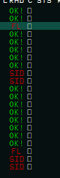
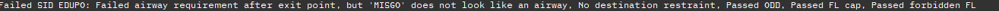
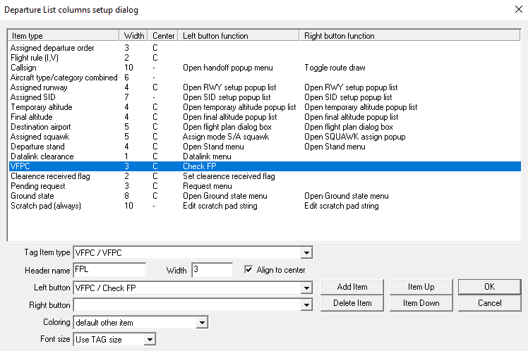

# Difference from original

The entire plugin has been rewritten to allow for a broader customisation and a much easier JSON format.  
Each SID now has 4 options it can have, of which one must be present (`"direction"`), as this indicates whether a given flight requires an even or odd level.

In addition it now supports full RAD implementation, as can be seen in the [Sids.json file](./json/Sids.json).

The plugin is customisable via the various options it can have in the JSON structure.

# VFPC Plugin

The VFPC or VATSIM Flight Plan Checker is a plugin for Euroscope that checks whether a given flight plan is filed correctly according to several rules. If all the rules pass a green `OK!` will show in the departure list, if any issues are found a red indicated message will appear.



The SIDs that are available in the [Sids.json file](./json/Sids.json) are all valid EHAA SIDs, the SID restrictions are updated per DutchVACC requirements with restrictions on which SID can go where and the ceiling of the given SID.

Whenever errors are found, an explanation can be requested and will appear in a new chat window.


## Features:
- Tag item VFPC: Shows check-result as green 'OK!' or red values ('SID' = A SID error, 'RTE' = A routing error, 'FL' = A flight level error)
- Tag function 'Check FP': Explains the check-result in chat output
- Chat command '.vfpc reload': reload the Sids.json config
- Chat command '.vfpc check': checks currently selected AC and outputs result
- Restrictions customizable in Sids.json config
- Checks Even/Odd Flight level restriction (based on SID)
- Checks Maximum Flight level restriction (based on RAD or SID)
- Checks whether an airway is present after the final SID fix (meaning no DCT allowed, customisable per SID)
- Checks if a given SID may only be applied for given destinations 

## How to use:
- Copy both the VFPC.dll and Sids.json file into a given (it must be in the same) directory
- Load up the Plugin via Euroscope
- Add Tag Item type & function to Departure List 
- You're all setup!


### How to define configurations

The Sids.json file can be adjusted to your needs. It supports a SID mapping, where SID names don't match the initial fix, SIDs with different restraints per SID and RAD configurations.

A minimal example of a valid configuration for only a SID:
```json

{
    "sid_details": [
        {
            "icao": "XXXX",
            "sids": {
                "SID_NAME": [
                    {
                        "direction": "EVEN / ODD",
                    }
                ],
            }
        }
    ]
}
```

Optionally for the SID the following options are considered:
```json
    "destinations": [
        "XXX"
    ],
    "airway_required": false,
    "max_fl": 75
```

A full minimal example including RAD restrictions:


```json

{
    "sid_details": [
        {
            "icao": "XXXX",
            "sids": {
                "SID_NAME": [
                    {
                        "direction": "EVEN / ODD",
                    }
                ],
            }
        }
    ],
    "restrictions": [
        {
            "id": "ED4223",
            "from": [
                "EHAM"
            ],
            "routes": [
                {
                    "destinations": [
                        "EDDM "
                    ],
                    "fl_capping": 355
                }
            ],
            "applicability": "AIRAC APR – FIRST AIRAC OCT"
        }
    ]
}
```

As can be seen the restrictions all allow an ID to be added, this ID is not used by the Plugin, but added for ease of maintenance. 


#### Available parameters for SIDs
- direction: **Required**, can be either `EVEN` or `ODD`
- destinations: This is a list of ICAO codes
- airway_required: This specifies whether an airway is required after the initial SID fix (if unset defaults to true)
- max_fl: This specifies a maximum flight level for the SID

#### Available parameters for the restrictions
- id: **Required**, not used by the plugin, doesn't have to be unique
- from: **Required**, a list to of ICAO codes to which the restriction applies (origin)
- routes: **Required**, a list of routes which are part of the same restriction
  - destinations: **Required**, a list of destinations to which the restriction applies
  - fl_capping: **Required**, the maximum flight level for the restriction
- applicability: The applicability of the restriction [WIP, currently unused]


For more examples refer to the [Sids.json file](./json/Sids.json).
